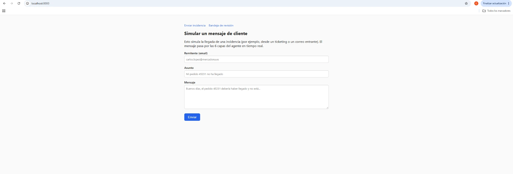
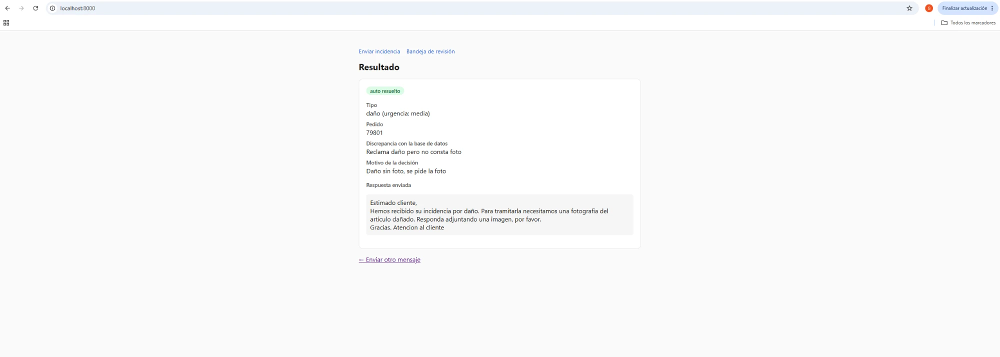

# Agente de triaje de incidencias logísticas

Un sistema que recibe mensajes de clientes con incidencias de envío, los clasifica, los contrasta con los datos reales del pedido y prepara una respuesta. Lo inofensivo se responde solo. Lo que tiene consecuencias va a una persona, y de verdad se queda esperando a que esa persona decida.

Está construido como un grafo de LangGraph con seis capas, sobre la idea de que **la seguridad está en la arquitectura, no en confiar en que el modelo acierte siempre**.

Gestioné incidencias de transporte a mano durante seis años como jefe de tráfico. Este proyecto automatiza ese trabajo, y el diseño sale de ahí más que de ningún curso.

---

## De notebook a producción

Este proyecto empezó como un notebook de Colab para probar una idea de arquitectura de seguridad, con ataques reales incluidos (prompt injection, fraude por valor inflado, autoridades inventadas...). Ese notebook sigue intacto en [`prototipo/`](prototipo/), con su propio README explicando qué se probó y qué se rompió.

Esta segunda fase toma esa misma lógica de negocio (sin cambiarla) y la lleva a algo que se puede desplegar y usar de verdad:

| | Prototipo (`prototipo/`) | Producción (`app/`) |
|---|---|---|
| Entrada/salida | Celdas de notebook, a mano | API REST + demo web |
| Base de datos | SQLite en el propio Colab | PostgreSQL |
| Control humano | Solo enrutado (etiqueta, no bloqueo) | Bloqueo real con `interrupt()` de LangGraph: el grafo se pausa de verdad |
| Pruebas | 18 celdas manuales | pytest + CI en GitHub Actions |
| Configuración | API key en secretos de Colab | Variables de entorno (`.env`) |
| Despliegue | Ninguno | Docker Compose |

---

## El recorrido de un mensaje

```
guardian → clasificar → enriquecer → decidir → verificar → revisar_humano / auto_resuelto
 (reglas)    (LLM)      (base datos)  (reglas    (LLM juez)     ↑
                                       + LLM)                    │
                                                    aquí el grafo se PAUSA de verdad
                                                    hasta que alguien aprueba o rechaza
```

Las vías están dibujadas de antemano. El modelo trabaja dentro de los nodos, pero no elige el camino. La única salida que evita a un humano es `auto_resuelto`, y solo la alcanzan los casos 100% deterministas (plantillas fijas de Python, sin texto libre de un LLM de por medio).

### Las seis capas

1. **Guardián — sin LLM.** Reglas baratas que cazan lo evidente antes de gastar una llamada al modelo.
2. **Clasificar — con LLM.** Extrae tipo, urgencia, transportista y número de pedido con salida estructurada (`Literal` de Pydantic).
3. **Enriquecer — sin LLM.** Contrasta el mensaje con la base de datos real: si el pedido existe, si quien escribe es el titular, si lo que cuenta cuadra.
4. **Decidir — reglas + LLM.** Tres niveles: casos mecánicos que se auto-resuelven con plantillas fijas, reglas que escalan lo crítico, y el LLM solo para los casos grises de bajo riesgo.
5. **Verificar — con LLM.** El juez de salida: revisa que el borrador no prometa dinero, no filtre datos de otros pedidos, ni se salga del papel.
6. **Revisar humano.** Todo lo que no es 100% determinista se pausa aquí (`interrupt()`, persistido en Postgres) hasta que una persona lo aprueba o lo rechaza desde el panel.

---

## Cómo ejecutarlo

```bash
cp .env.example .env
# edita .env y pon tu GROQ_API_KEY (gratis en console.groq.com)
docker compose up --build
```

- Formulario para simular un mensaje entrante: http://localhost:8000/
- Panel de revisión humana: http://localhost:8000/revision (usuario/contraseña de `.env`)
- Documentación interactiva de la API: http://localhost:8000/docs

### Cómo se ve

El formulario para simular un mensaje entrante:



Y el resultado de un caso que el sistema resuelve solo: un daño sin foto, al que contesta pidiéndola con una plantilla fija.



## Cómo correr los tests

```bash
pip install -r requirements-dev.txt
pytest
```

Los tests de las capas deterministas (guardián, enriquecer, decidir) y el mecanismo de `interrupt()` no necesitan ninguna clave. Los 18 casos de seguridad del notebook original (`tests/test_seguridad.py`) sí necesitan una `GROQ_API_KEY` real — se saltan solos si no la tienen, tanto en local como en CI.

---

## Stack

- **LangGraph** para el grafo de estados, con **PostgreSQL** como backend del checkpointer (lo que hace posible el `interrupt()` real)
- **gpt-oss-120b vía Groq** como modelo — gratis, y coherente con la idea del proyecto: no le confío la seguridad al modelo, de eso se encargan las capas deterministas
- **FastAPI** para la API y el panel web (Jinja2)
- **SQLAlchemy + Alembic** para los datos de negocio (pedidos, incidencias) sobre PostgreSQL
- **pytest + GitHub Actions** para las pruebas, incluyendo regresión de seguridad

---

## Limitaciones, dichas claras

- Los pedidos son de prueba: cuatro registros, uno preparado a propósito para el caso de fraude por valor inflado (igual que en el prototipo).
- No hay envío real de email/tickets: la "respuesta enviada" es el texto final que el sistema produce, no una integración con un proveedor de correo o un ticketing real. Añadirla es cuestión de un adaptador en `app/api/` o `app/web/`, no de tocar el grafo.
- El panel de revisión usa autenticación básica de un solo usuario; para varios revisores haría falta gestión de usuarios de verdad.

---

## Licencia

MIT
